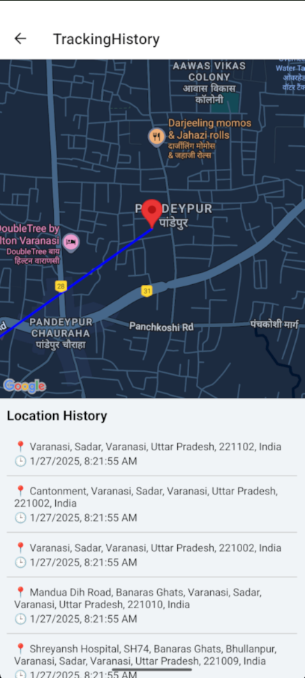

# 🛰️ Admin Portal: Sales Executive Location Tracking App

A React Native Admin Panel designed to **track sales executives’ live location and route history**. The app fetches location data from a real-time API and displays it on a map with proper markers, polylines, and timestamps.

This project simulates a **real enterprise tracking use-case** and demonstrates your ability to build powerful, production-ready mobile applications using native technologies.

---

## 📱 App Screenshots

### 📋 Dashboard – List of Employees

Shows all tracked employees fetched from backend API.

### 🗺️ Tracking History – Route on Map with Timestamps

Displays the executive’s movement using Google Maps with accurate markers, lines, and logs.

---

## ✨ Key Features

- 🔐 **Admin Login** with session-based access (coming soon)
- 📋 **Dashboard Screen** to display employee list (with empID)
- 📍 **Live Location Tracking** of individual sales executives
- 🗺️ **Map View** using `react-native-maps` with:
  - Markers for each location update
  - Polylines to connect the movement route
- 🕒 **Location Log Section** with latitude, longitude, and timestamp
- ⚙️ Clean component-based code structure
- ⚡ Powered by live backend API (`GET /LocationTrack/GetEmplLocationTrack?empID=`)

---

## 💻 Tech Stack

| Area             | Technology                     |
|------------------|--------------------------------|
| Mobile Framework | React Native (CLI setup)       |
| Maps             | `react-native-maps` (Google)   |
| API Handling     | Axios                          |
| UI Components    | React Native Views & Styles    |
| Navigation       | `@react-navigation/native`     |
| Backend API      | External REST endpoint         |
| Platform         | Android                        |

---

## 🏗️ Project Structure

Admin_ath/
├── App.jsx
├── api.js
├── DashboardScreen.jsx
├── LoginScreen.jsx
├── TrackingHistoryScreen.jsx
├── index.js
├── img/
│ ├── dashboard.png
│ └── tracking.png
├── package.json
├── android/
└── README.md

---

## ⚙️ How to Run the Project Locally

### 1. Clone the Repository
git clone https://github.com/nidhaandubey/Ath_admin_portal.git
cd Ath_admin_portal

### 2. Install Dependencies
npm install

### 3. Start Metro Bundler
npx react-native start

## 4. Run on Android Device
npx react-native run-android
---
##📱 Make sure your emulator or physical Android device is connected.
---
##📦 API Used
Get Tracking History of Employee
GET /LocationTrack/GetEmpl******ationTrack?empID={id}
Get Last Known Location
GET /LocationTrack/GetEmpl******ation?empID={id}
---
##💼 Use Case Scenario
This project is built to simulate a real-world field staff tracking system, where:

Sales Executives carry a location tracking app.

Managers/Admins use this admin panel to monitor their movement.

All location data is timestamped and visualized using maps.

Ideal for companies in:

FMCG

Logistics & Courier

Field Sales

Marketing Teams
---
##📫 Reach me:

📧 Email: nidhaandubey2@gmail.com

💼 LinkedIn: https://www.linkedin.com/in/nidhaan-dubey-73a790250/
